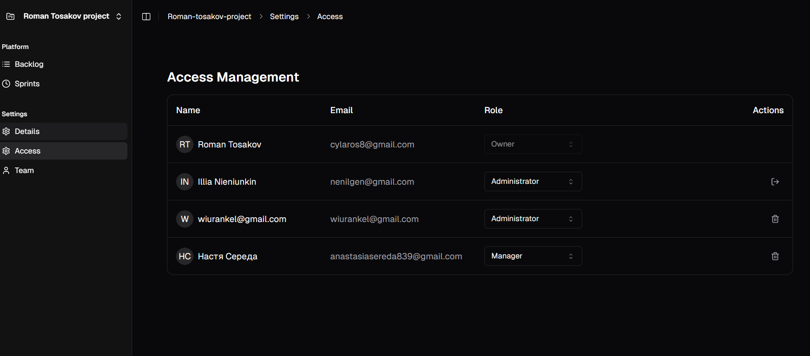

# Quick Start Guide

## 🚀 Getting Started in 5 Minutes

### 1. Sign Up
1. Visit the application URL
2. Enter your email address
3. Fill in your name and password
4. Verify your email (check inbox)
if user not exists 

    

if user exists

    

### 2. Create Your First Project
1. Click "New Project" on dashboard
2. Enter project name and description
3. Choose a project key (e.g., "PROJ")
4. Click "Create Project"
project name must be minimmum 3 characters and maximum 255 characters
    

### 3. Invite Team Members
1. Go to Project Settings > Team
2. Click "Invite Member"
3. Enter colleague's email
4. Select their role
5. Send invitation
    
    
    

### 4. Create Your First Task
1. Navigate to project backlog
2. Click "Create Task"
3. Enter task title and description
4. Assign to team member (optional)
5. Set priority and due date
6. Save task
    
if you click on Create you can write task name
    
if you click enter you can see task created
    

### 5. Start a Sprint
1. Go to Sprints section
    
2. Click "Create Sprint"
    
3. Set sprint name and if you want duration and description 
    
4. Start the sprint
5. Add tasks same as in backlog
    

6. Add tasks from backlog
Return to backlog section(button in side bar)
    
Open task(click on it) and choose sprint
    

  

## 🎯 Key Features Overview

### Task Management
- Create and assign tasks
    
- Update task status
    
- Add comments and description in task(click on task)
    

### Team Collaboration
- Invite team members
    
- Assign roles
    

### Change Project Details
- Click on Details in sidebar
    
- Click on Edit button
    
- Change name project key and team lead
    

